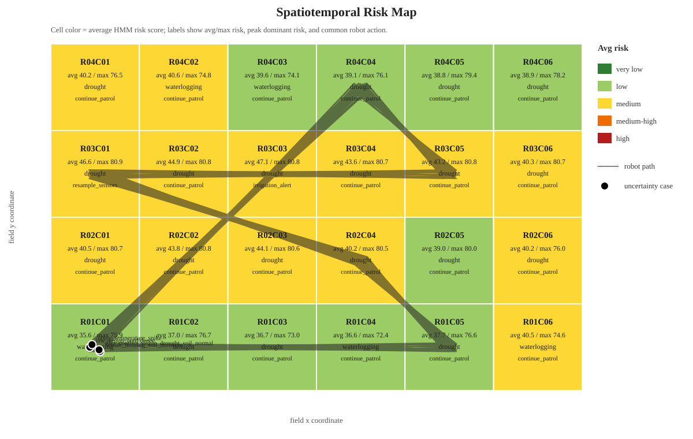

# Agricultural_monitoring_system_based_on_IoT_data

## 项目报告总览

### 1. 研究背景

农业与野外环境具有光照变化大、传感器易失效、环境遮挡多、作物状态变化缓慢等特点。对于农业/野外巡检机器人来说，仅依赖单一传感器或单次图像识别结果容易产生误判。例如，图像可能因为遮挡或光照导致低置信度，土壤湿度传感器可能出现缺失值，温度读数可能因硬件异常产生尖峰。因此，本项目关注的问题不是简单地判断“是否干旱”，而是研究机器人在多模态感知存在噪声、缺失和冲突时，如何维护可靠的环境状态估计，并做出安全、可解释的行动决策。

本项目将农业监测场景抽象为一个“不确定多模态感知与安全具身决策”问题：系统需要同时处理环境传感器数据和视觉状态标签，在不确定情况下避免直接执行可能错误的农业动作，而是优先选择复查、重新采样或继续观察。

### 2. 方法设计

系统采用“模拟数据 + 概率状态估计 + 动态可靠性融合 + 安全决策”的方法完成原型验证。整体设计包括：

| 模块 | 作用 |
| --- | --- |
| 模拟数据生成 | 生成温度、湿度、土壤湿度、光照、降雨量、图像标签和视觉置信度 |
| 机器人位姿与区域建模 | 生成机器人坐标、朝向、巡检路径段和空间区域 ID |
| 单模态状态估计 | 分别从环境传感器和图像标签估计健康、干旱、高温、病虫害、积水、低光照、传感器异常等状态概率 |
| 动态可靠性调整 | 根据传感器缺失、异常值、视觉置信度低和模态冲突动态调整融合权重 |
| 时间序列状态估计 | 使用 6 小时滑动窗口和 HMM/Bayesian filter 维护连续状态信念 |
| 时空风险地图 | 将时间风险结果与机器人路径、区域网格聚合，形成区域级风险热力图 |
| 不确定性评估 | 计算缺失、冲突、异常、低置信度和概率分布分散带来的不确定性 |
| 安全决策层 | 根据风险等级与不确定性决定执行、复查、重新采样或常规巡检 |
| 机器人动作接口 | 将安全策略映射为复查、绕行、重新采样、灌溉提醒等结构化机器人命令 |
| 实验评估与可视化 | 比较不同融合方法，并生成风险曲线、概率曲线、不确定性曲线和时空风险地图 |

### 3. 算法流程

```text
模拟数据输入
→ 数据清洗
→ 单模态概率状态估计
→ 动态模态可靠性调整
→ 多模态概率融合
→ HMM/Bayesian filter 时间状态估计
→ 不确定性评估
→ 安全决策层
→ 机器人动作计划
→ 输出风险等级和建议动作
```

其中，核心改进在于系统不直接输出单一标签，而是维护状态概率分布：

```text
P(healthy), P(drought), P(heat), P(pest),
P(waterlogging), P(low_light), P(sensor_anomaly)
```

这种设计使系统能够表达“当前最可能是干旱，但仍存在病虫害和传感器异常的可能性”，比普通规则判断更适合复杂野外环境。

### 4. 实验结果

项目共生成 1000 条模拟巡检数据，并人为加入传感器缺失、模态冲突、低置信度视觉和温度异常尖峰等不确定性样本。实验比较了三种方法：

| 方法 | 风险类别准确率 | 不确定性检测率 | 冲突检测率 | 异常值检测率 | 不确定风险安全阻止率 |
| --- | --- | --- | --- | --- | --- |
| `rule_fusion` | 0.977 | 0.000 | 0.000 | 1.000 | 0.076 |
| `fixed_weighted_fusion` | 0.966 | 1.000 | 1.000 | 1.000 | 1.000 |
| `uncertainty_weighted_fusion` | 0.948 | 1.000 | 1.000 | 1.000 | 1.000 |

结果表明，规则融合在干净样本上的类别匹配率较高，但无法识别不确定性和模态冲突；不确定性动态加权融合虽然牺牲了一部分静态分类准确率，但能稳定检测不确定性，并在不确定中高风险场景中阻止直接执行动作，更符合安全具身自主系统的需求。

### 5. 局限性

当前项目仍是原型验证，主要局限包括：

- 数据来自模拟生成，尚未接入真实传感器、真实机器人或真实农田图像。
- 图像模块目前使用 `image_status` 和 `vision_confidence` 模拟视觉识别结果，没有训练真实视觉模型。
- 状态估计已使用离散 HMM/Bayesian filter，但转移矩阵和观测似然仍是人工设计，尚未通过真实数据学习。
- 安全决策层是离散策略规则，还没有连接真实机器人控制器或执行器。
- 评估标签来自模拟规则推断，不能完全代表真实农田环境中的人工标注结果。

### 6. 后续工作

后续可以从以下方向继续提升：

1. 接入真实或公开农业图像数据集，将 `image_status` 替换为真实视觉模型输出。
2. 接入真实 IoT 传感器或边缘设备，验证算法对真实噪声和缺失值的适应能力。
3. 使用真实标注数据学习 HMM 转移矩阵和观测似然，替代当前人工设定参数。
4. 将模拟位姿替换为真实机器人 GPS、SLAM 或里程计位姿，并校准空间区域边界。
5. 将 `robot_action_commands.csv` 对接 ROS/仿真器或真实机器人控制器，验证复查、绕行、重新采样和提醒动作的闭环执行。
6. 设计更多实验指标，例如决策延迟、安全误触发率、风险漏检率和模态退化鲁棒性。

## 具体场景

本项目定位为一个面向农业/野外巡检机器人的作物状态监测与风险判断系统。机器人在农田或温室环境中巡检时，持续采集环境传感器数据，并结合模拟图像状态识别结果，判断作物是否存在干旱、高温、低光照、积水或异常风险，最终输出风险等级和行动建议。

当前阶段先不依赖真实硬件、真实传感器或真实图像，而是使用模拟环境数据完成系统原型。这样可以先验证数据处理、风险判断和后续多模态融合流程，等有真实设备或公开数据集后再替换数据输入层。

## 目标描述

系统根据温度、空气湿度、土壤湿度、光照、降雨量、图像状态标签和图像置信度，判断作物生长风险，并给出可解释的建议动作。例如：当土壤湿度持续偏低且图像标签显示干旱时，系统应识别为干旱风险；当图像标签置信度较低或传感器数据冲突时，系统应降低决策确定性，并建议机器人复查该区域。

## 模拟环境数据

已生成 1000 条模拟环境数据：

- 数据文件：`data/mock_environment_data.csv`
- 生成脚本：`scripts/generate_mock_environment_data.py`
- 时间范围：从 `2026-08-03 00:00` 开始，按小时生成

字段说明：

| 字段 | 含义 | 单位 |
| --- | --- | --- |
| `timestamp` | 数据采集时间 | 年-月-日 时:分 |
| `temperature` | 环境温度 | 摄氏度 |
| `humidity` | 空气湿度 | % |
| `soil_moisture` | 土壤湿度 | % |
| `light` | 光照强度 | 归一化强度 0-1000 |
| `rainfall` | 小时降雨量 | mm |
| `image_status` | 模拟图像识别结果，包含 `healthy`、`drought`、`pest`、`waterlogging`、`unknown` | 类别 |
| `vision_confidence` | 图像识别置信度 | 0-1 |
| `uncertainty_case` | 不确定性测试类型，正常数据为 `normal` | 类别 |
| `robot_x_m` | 机器人在田块坐标系中的 x 坐标 | m |
| `robot_y_m` | 机器人在田块坐标系中的 y 坐标 | m |
| `robot_heading_deg` | 机器人朝向角，0 为北，90 为东 | 度 |
| `region_id` | 空间区域编号，例如 `R01C03` | 类别 |
| `path_segment` | 巡检路径段，例如 `row_1` | 类别 |
| `patrol_loop` | 第几轮巡检循环 | 次 |

## 模拟图像标签

当前项目不直接使用真实图片，而是用 `image_status` 和 `vision_confidence` 表示图像识别模块的输出：

```csv
image_status,vision_confidence
healthy,0.92
drought,0.81
pest,0.74
unknown,0.35
```

这样可以先研究“视觉结果存在不确定性时，系统如何融合传感器数据并做出稳健决策”。后续如果加入真实图像模型，只需要把模型预测结果写入这两个字段即可。

## 不确定性测试

数据集中已人为插入 4 类测试场景：

| `uncertainty_case` | 含义 | 目的 |
| --- | --- | --- |
| `sensor_missing_soil_moisture` | 土壤湿度字段为空 | 测试传感器缺失时系统是否能继续判断 |
| `data_conflict_vision_drought_soil_normal` | 图像显示干旱，但土壤湿度正常 | 测试多模态数据冲突处理 |
| `low_vision_confidence` | 图像置信度固定为 0.35 | 测试低置信度视觉结果对决策的影响 |
| `noisy_temperature_spike` | 温度被设置为异常高值 | 测试传感器噪声或异常值检测 |

## 核心算法流程

核心算法已实现为 `scripts/analyze_crop_risk.py`，完整流程如下：

```text
模拟数据输入
→ 数据清洗
→ 单模态概率状态估计
→ 动态模态可靠性调整
→ 多模态概率融合
→ HMM/Bayesian filter 时间状态估计
→ 不确定性评估
→ 安全决策层
→ 输出风险等级和建议动作
```

### 1. 模拟数据输入

算法读取 `data/mock_environment_data.csv`，输入字段包括环境传感器数据、模拟图像标签、图像置信度和不确定性测试标签。

### 2. 数据清洗

数据清洗阶段负责：

- 检查必要字段是否存在
- 将温度、湿度、土壤湿度、光照、降雨量、视觉置信度转换为数值
- 识别缺失值，例如土壤湿度为空
- 识别异常值，例如温度超过合理范围
- 校验 `image_status` 是否属于允许类别

### 3. 单模态概率状态估计

算法不再只输出“是否干旱”这样的硬判断，而是把环境状态建模为概率分布：

```text
P(healthy)=0.18
P(drought)=0.62
P(heat)=0.08
P(pest)=0.03
P(waterlogging)=0.04
P(low_light)=0.02
P(sensor_anomaly)=0.03
```

环境传感器单独估计一次状态概率，输出 `sensor_probabilities` 和 `sensor_score`。例如：

- 土壤湿度低：干旱风险
- 温度高：热胁迫风险
- 降雨量高且土壤湿度高：积水风险
- 温度异常尖峰：传感器噪声风险

图像标签也单独估计一次状态概率，输出 `vision_probabilities` 和 `vision_score`。例如：

- `drought`：图像疑似干旱
- `pest`：图像疑似病虫害
- `waterlogging`：图像疑似积水
- `unknown` 或低置信度：降低视觉可靠性

### 4. 动态模态可靠性调整

为了让融合过程更接近真实机器人系统，算法会根据数据质量动态调整环境传感器和视觉模态的权重：

| 情况 | 处理方式 |
| --- | --- |
| 传感器缺失 | 降低环境模态权重 |
| 传感器异常 | 降低环境模态权重，并提高不确定性 |
| 视觉置信度低 | 降低视觉模态权重 |
| 模态冲突 | 同时降低直接执行可靠性，提高不确定性 |
| 连续状态一致 | 提高主状态置信度，降低非异常情况下的不确定性 |

输出结果中会记录：

- `dynamic_sensor_weight`
- `dynamic_vision_weight`
- `reliability_adjustments`
- `consistency_flags`

### 5. 多模态概率融合

融合阶段不是直接平均风险等级，而是将传感器概率分布和图像概率分布按可靠性加权：

```text
P_fused(state)
= P_sensor(state) × dynamic_sensor_weight
+ P_vision(state) × dynamic_vision_weight
```

如果出现数据冲突，例如“图像显示干旱，但土壤湿度正常”，算法不会直接相信其中一个模态，而是提高不确定性，并建议机器人复查。

### 6. HMM/Bayesian filter 时间状态估计

机器人不应该只根据单个时刻做判断，因此算法加入了两个时间序列机制：

- 6 小时滑动窗口：检测土壤湿度持续下降、持续高温、持续湿润等趋势
- HMM/Bayesian filter：用状态转移矩阵预测当前先验，再用多模态观测似然更新后验

预测-更新公式：

```text
prediction_t(x) = Σ P(x_t=x | x_{t-1}=z) × belief_{t-1}(z)
belief_t(x) ∝ P(observation_t | x_t=x) × prediction_t(x)
```

当前实现中，隐藏状态为 `healthy`、`drought`、`heat`、`pest`、`waterlogging`、`low_light` 和 `sensor_anomaly`。HMM 转移矩阵用于表达作物风险状态的连续性，例如干旱、病虫害和积水通常不会在一个小时内突然完全消失；观测似然来自动态加权后的多模态概率分布，并会根据传感器缺失、异常值、低视觉置信度和模态冲突进行软化，避免不可靠观测导致后验过度自信。

### 7. 不确定性评估

算法会计算 `uncertainty_score`，主要来源包括：

- 关键传感器缺失
- 传感器异常值
- 图像置信度低
- 图像结果未知
- 图像和环境数据冲突
- 状态概率分布过于分散，即最高状态置信度较低

不确定性越高，系统越倾向于输出“复查、重新采样、人工确认”类建议，而不是直接执行灌溉或排水等动作。

### 8. 安全决策层

系统会根据风险等级和不确定性等级决定是否允许直接执行动作，并继续映射成机器人可执行的动作计划：

| 条件 | 安全策略 |
| --- | --- |
| 高风险 + 低不确定性 | 允许执行建议动作 |
| 高风险 + 高不确定性 | 先复查，不直接执行动作 |
| 中风险 + 高不确定性 | 重新采样后再决策 |
| 低风险 + 低不确定性 | 常规巡检 |
| 其他情况 | 继续观察并收集更多上下文 |

安全策略不会只停留在文字建议，而是生成结构化机器人命令：

| 机器人动作 | 触发场景 | 动作含义 |
| --- | --- | --- |
| `recheck_region` | 高风险但不确定性较高 | 导航回目标区域，减速复查，重新采集图像和环境数据 |
| `resample_sensors` | 中风险且不确定性较高 | 原地或短距离重复采样，等待新数据后再决策 |
| `reroute_and_drainage_check` | 积水风险较高 | 机器人绕开低通行性区域，并发送排水检查提醒 |
| `irrigation_alert` | 干旱风险高且观测可靠 | 标记目标区域并发送灌溉提醒，但仍要求控制器或人工确认 |
| `close_range_pest_inspection` | 病虫害风险可靠 | 低速靠近并采集近距离图像，标记疑似病虫害区域 |
| `sensor_diagnostics` | 传感器异常 | 暂停直接农业动作，执行传感器自检或校准 |
| `continue_patrol` | 低风险低不确定性 | 保持常规巡检和周期采样 |

输出结果中会记录：

- `action_permission`
- `safety_action`
- `safety_policy`
- `robot_action_mode`
- `motion_command`
- `perception_command`
- `actuator_command`
- `execution_guard`
- `command_status`

### 9. 输出风险等级和建议动作

运行后会生成 `data/risk_assessment_results.csv` 和 `data/robot_action_commands.csv`。前者保存完整风险估计结果，后者保存面向机器人控制接口的动作命令。

`data/risk_assessment_results.csv` 核心字段包括：

| 字段 | 含义 |
| --- | --- |
| `risk_score` | 基于 HMM 后验状态概率计算的风险分数 |
| `risk_level` | 风险等级：很低、低、中、中高、高 |
| `state_confidence` | 当前主风险状态的概率 |
| `p_healthy` 等概率列 | HMM 后验中的各状态概率 |
| `uncertainty_score` | 不确定性分数 |
| `uncertainty_level` | 不确定性等级：低、中、高 |
| `dominant_risk` | 主要风险类型 |
| `dynamic_sensor_weight` | 动态调整后的环境模态权重 |
| `dynamic_vision_weight` | 动态调整后的视觉模态权重 |
| `reliability_adjustments` | 模态可靠性调整原因 |
| `sensor_probabilities` | 传感器单模态状态概率 |
| `vision_probabilities` | 图像单模态状态概率 |
| `fused_probabilities` | 当前时刻多模态融合概率 |
| `hmm_prior_probabilities` | HMM 根据上一时刻状态预测得到的当前先验 |
| `observation_likelihoods` | 多模态观测转换得到的观测似然 |
| `hmm_posterior_probabilities` | HMM 预测-更新后的状态后验 |
| `observation_reliability` | 当前观测可靠性，用于软化不可靠观测似然 |
| `smoothed_probabilities` | 为兼容可视化保留的后验状态概率 |
| `trend_flags` | 6 小时滑动窗口检测到的趋势 |
| `consistency_flags` | 连续一致性标记 |
| `action_permission` | 是否允许执行动作 |
| `safety_action` | 安全决策动作 |
| `safety_policy` | 安全策略解释 |
| `robot_action_mode` | 机器人动作模式，例如复查、绕行、重新采样或灌溉提醒 |
| `action_priority` | 动作优先级 |
| `target_region` / `target_x_m` / `target_y_m` | 机器人动作目标区域和坐标 |
| `motion_command` | 运动层命令，例如导航到区域、绕行、继续巡检 |
| `perception_command` | 感知层命令，例如近距离拍照、重新采样、传感器自检 |
| `actuator_command` | 执行/提醒命令，例如发送灌溉提醒、排水提醒或禁止执行 |
| `operator_notification` | 给操作者或上层系统的解释性通知 |
| `execution_guard` | 动作安全约束，说明是否需要复查、人工确认或禁止直接执行 |
| `command_status` | 命令状态，例如 ready、queued_for_recheck、queued_for_resampling |
| `reasons` | 可解释原因 |
| `recommendation` | 建议动作 |

`data/robot_action_commands.csv` 可以视为一个简化机器人动作接口，适合后续接 ROS、机器人仿真器或真实控制器。

示例输出逻辑：

```text
风险等级：中高
状态概率：P(healthy)=0.12；P(drought)=0.71；P(heat)=0.06；P(pest)=0.03；P(waterlogging)=0.04；P(low_light)=0.02；P(sensor_anomaly)=0.02
不确定性：中
原因：土壤湿度偏低；图像标签疑似干旱；最近 6 小时土壤湿度持续下降
机器人动作：irrigation_alert
运动命令：continue_patrol_after_marking:R03C04
感知命令：verify_soil_moisture_next_pass
执行/提醒：send_irrigation_alert
安全约束：human_or_controller_confirmation_required_for_irrigation
建议：若低湿状态连续出现，触发灌溉提醒
```

## 机器人位姿、路径与时空风险地图

已新增 `scripts/build_spatiotemporal_risk_map.py`，用于将机器人位姿、巡检路径和风险评估结果合成为时空风险地图。当前模拟田块大小为 `120m × 80m`，划分为 `6 × 4` 个空间区域。机器人采用类似农业巡检中的往复式路径，在每个时间点记录所在区域、坐标和朝向。

完整时空处理流程如下：

```text
模拟环境数据 + 机器人位姿
→ HMM 风险评估结果
→ 按 timestamp 合并
→ 按 region_id 聚合
→ 生成区域级风险地图
```

运行时空地图构建：

```bash
python3 scripts/build_spatiotemporal_risk_map.py
```

生成文件：

| 文件 | 含义 |
| --- | --- |
| `data/spatial_risk_observations.csv` | 每条巡检观测对应的机器人位姿、区域、风险等级和安全动作 |
| `data/spatiotemporal_risk_map.csv` | 每个空间区域聚合后的平均风险、最大风险、不确定性比例和主要安全动作 |
| `data/robot_action_commands.csv` | 每个时间点对应的机器人动作计划、运动命令、感知命令和执行/提醒命令 |

`data/spatiotemporal_risk_map.csv` 的核心字段包括：

| 字段 | 含义 |
| --- | --- |
| `region_id` | 空间区域编号 |
| `center_x_m` / `center_y_m` | 区域中心坐标 |
| `sample_count` | 该区域被巡检采样的次数 |
| `avg_risk_score` | 区域平均风险分数 |
| `max_risk_score` | 区域历史最大风险分数 |
| `risk_observation_rate` | 该区域被判为中等及以上风险的比例 |
| `avg_uncertainty_score` | 区域平均不确定性分数 |
| `high_uncertainty_rate` | 该区域中等及以上不确定性的比例 |
| `dominant_risk_mode` | 该区域最常见的主风险类型 |
| `peak_dominant_risk` | 该区域最高风险时刻对应的主风险 |
| `latest_safety_action` | 最近一次巡检时的安全动作 |
| `latest_robot_action_mode` | 最近一次巡检生成的机器人动作模式 |
| `most_common_robot_action_mode` | 该区域最常见的机器人动作模式 |
| `latest_motion_command` | 最近一次巡检生成的运动命令 |
| `latest_actuator_command` | 最近一次巡检生成的执行/提醒命令 |

这种地图让系统不只回答“当前是否有风险”，还可以回答“哪个区域风险更高、风险是否持续出现、机器人下一步应该优先复查哪里”。这使项目从时间序列风险估计扩展为面向机器人巡检的时空风险建图。

## 结果可视化

已新增 `scripts/visualize_results.py`，用于把风险评估结果和实验对比结果转换为 SVG 图表。图表输出目录为 `figures/`。

运行可视化：

```bash
python3 scripts/visualize_results.py
```

### 风险曲线

该图展示 `risk_score` 随时间变化的趋势，并标出中风险和中高风险阈值。图中的竖向虚线表示人为插入的不确定性测试样本。


### 状态概率曲线

该图展示 HMM 后验状态概率分布，包括健康、干旱、高温、病虫害、积水、低光照和传感器异常。它可以体现系统不是只做单点分类，而是在连续维护一个概率化环境状态。


### 不确定性曲线

该图展示 `uncertainty_score` 随时间变化的趋势，用于观察缺失值、模态冲突、低置信度视觉结果和传感器异常如何影响系统决策可靠性。


### 融合方法对比图

该图比较规则融合、固定权重概率融合和不确定性动态加权融合在风险识别、不确定性检测和安全阻止执行方面的表现。


### 时空风险地图

该图将区域平均风险热力图、机器人巡检路径、不确定性样本位置和区域常见机器人动作叠加展示。颜色越接近红色，表示该区域平均风险越高；黑色折线表示机器人巡检路径；黑色圆点表示人为插入的不确定性测试样本位置。



## 实验评估指标

已新增 `scripts/evaluate_fusion_methods.py`，用于比较 3 种融合方法：

| 方法 | 含义 |
| --- | --- |
| `rule_fusion` | 规则融合基线 |
| `fixed_weighted_fusion` | 固定权重概率融合 |
| `uncertainty_weighted_fusion` | 动态可靠性 + HMM/Bayesian filter + 安全决策融合 |

评估脚本会生成：

- `data/fusion_method_comparison.csv`：整体指标对比
- `data/fusion_method_predictions.csv`：每条样本的预测结果

当前评估指标包括：

| 指标 | 含义 |
| --- | --- |
| `risk_class_accuracy` | 风险类别识别准确率 |
| `binary_risk_accuracy` | 是否存在风险的二分类准确率 |
| `risk_detection_recall` | 真实风险样本中被系统识别为风险的比例 |
| `risk_miss_rate` | 真实风险样本中被漏检为非风险的比例，越低越好 |
| `avg_decision_latency_hours` | 从真实风险事件开始到系统首次响应风险的平均延迟，单位为小时 |
| `worst_decision_latency_hours` | 单个风险事件中最差响应延迟，单位为小时 |
| `risk_event_miss_rate` | 连续风险事件完全没有被响应的比例，越低越好 |
| `safety_false_trigger_rate` | 干净健康样本中不必要触发安全动作或风险响应的比例，越低越好 |
| `degraded_binary_risk_accuracy` | 模态退化样本中的风险二分类准确率 |
| `degraded_uncertainty_detection_rate` | 模态退化样本中不确定性被识别出来的比例 |
| `degraded_safe_response_rate` | 退化且存在风险的样本中系统避免直接执行动作的比例 |
| `modality_degradation_robustness` | 综合退化鲁棒性，取退化风险准确率、不确定性检测率和安全响应率的平均值 |
| `degraded_accuracy_retention` | 模态退化样本准确率相对干净样本准确率的保持率 |
| `uncertainty_detection_rate` | 不确定性场景检测率 |
| `conflict_detection_rate` | 模态冲突检测率 |
| `anomaly_detection_rate` | 异常值检测率 |
| `safe_hold_rate_on_uncertain_risk` | 不确定中高风险场景下是否能阻止直接执行动作 |

当前实验结果：

| 方法 | 风险类别准确率 | 不确定性检测率 | 冲突检测率 | 异常值检测率 | 不确定风险安全阻止率 |
| --- | --- | --- | --- | --- | --- |
| `rule_fusion` | 0.977 | 0.000 | 0.000 | 1.000 | 0.076 |
| `fixed_weighted_fusion` | 0.966 | 1.000 | 1.000 | 1.000 | 1.000 |
| `uncertainty_weighted_fusion` | 0.948 | 1.000 | 1.000 | 1.000 | 1.000 |

新增安全与鲁棒性指标结果：

| 方法 | 风险召回率 | 风险漏检率 | 平均决策延迟/h | 风险事件漏检率 | 安全误触发率 | 模态退化鲁棒性 |
| --- | --- | --- | --- | --- | --- | --- |
| `rule_fusion` | 0.989 | 0.011 | 0.00 | 0.093 | 0.000 | 0.349 |
| `fixed_weighted_fusion` | 0.969 | 0.031 | 0.03 | 0.278 | 0.000 | 0.991 |
| `uncertainty_weighted_fusion` | 0.944 | 0.056 | 0.22 | 0.333 | 0.000 | 0.991 |

## 实验分析

从风险类别准确率看，`rule_fusion` 的数值最高，达到 0.977。这说明在干净、规则明确的模拟样本中，简单规则可以很好地匹配人工设定的风险标签。但是它的不确定性检测率和冲突检测率都是 0.000，说明它只能判断“像不像某类风险”，无法判断“当前判断是否可靠”。对于野外机器人或辅助机器人来说，这种方法存在安全缺陷：当传感器缺失、图像与土壤湿度冲突、视觉置信度过低时，系统仍可能给出看似确定的动作建议。

`fixed_weighted_fusion` 将传感器和视觉结果都转换为概率分布，并加入不确定性检测，因此在不确定性检测、冲突检测、异常值检测和安全阻止执行方面都达到 1.000。相比规则融合，它更适合处理多模态输入不完整或互相矛盾的情况。但它的问题是模态权重基本固定，不能充分表达“某个时刻哪一种模态更可信”。例如视觉置信度很低时，它虽然能检测不确定性，但融合逻辑本身仍缺少更细粒度的动态可靠性调整。

`uncertainty_weighted_fusion` 的风险类别准确率为 0.948，略低于规则融合，但它保留了 1.000 的不确定性检测率、冲突检测率、异常值检测率和安全阻止率。这个结果符合安全具身自主系统的设计目标：系统不追求在每个时刻都做出最激进的单点分类，而是优先维护可靠状态估计，并在不确定中高风险场景中选择复查、重新采样或暂缓执行。升级为 HMM/Bayesian filter 后，系统利用状态转移先验保留风险连续性，同时利用观测似然吸收当前多模态证据，比简单时间平滑更符合概率状态估计框架。

因此，本项目的核心技术价值不在于单纯提高分类准确率，而在于构建了一个面向噪声环境的决策框架：多模态输入先被转换为状态概率，随后根据模态可靠性动态调整权重，再通过 HMM/Bayesian filter 维护连续状态信念，最后由安全决策层决定是否执行动作。这更符合农业/野外巡检机器人在真实环境中的需求。

新增指标进一步说明了不同方法的取舍：规则融合的风险漏检率和平均决策延迟最低，但模态退化鲁棒性只有 0.349，因为它几乎不能识别不确定性，也不能在退化风险场景中稳定阻止直接执行。固定权重融合和不确定性动态加权融合的模态退化鲁棒性均达到 0.991，说明它们在传感器缺失、视觉低置信度、模态冲突和异常值场景中更安全。HMM 版本的平均决策延迟为 0.22 小时，略高于固定权重方法，这是时间状态估计带来的保守性：它减少单点噪声导致的激进动作，但可能在风险刚出现时需要更多连续证据。

## 案例分析：从观测到安全动作

下面选取 3 个真实感较强的不确定性样本，展示系统如何从原始观测出发，经过概率状态估计和不确定性评估，最终生成安全动作。

### 案例 1：土壤湿度传感器缺失

| 环节 | 内容 |
| --- | --- |
| 时间 | `2026-08-08 00:00` |
| 观测 | 温度 `20.5`，空气湿度 `73.7`，土壤湿度缺失，降雨量 `5.2`，图像标签 `healthy`，视觉置信度 `0.85` |
| 概率状态 | `P(healthy)=0.89`，`P(drought)=0.09`，其他状态约为 `0.00-0.01` |
| 不确定性 | `uncertainty_score=32.0`，等级为中 |
| 安全动作 | `monitor_more_context`：继续观察并收集更多上下文 |

虽然图像标签显示健康，但土壤湿度是判断干旱风险的关键变量。系统因此降低环境模态可靠性，并没有直接输出“完全健康”的结论。最终建议机器人复查该区域并补采土壤湿度数据。这体现了系统对传感器缺失的保守处理能力。

### 案例 2：图像与土壤湿度冲突

| 环节 | 内容 |
| --- | --- |
| 时间 | `2026-08-18 00:00` |
| 观测 | 温度 `18.6`，空气湿度 `77.7`，土壤湿度 `42.0`，降雨量 `5.0`，图像标签 `drought`，视觉置信度 `0.84` |
| 概率状态 | `P(healthy)=0.59`，`P(drought)=0.40`，其他状态约为 `0.00-0.01` |
| 不确定性 | `uncertainty_score=35.0`，等级为中 |
| 安全动作 | `resample_before_action`：重新采样后再决策 |

该样本中，视觉模态认为作物疑似干旱，但土壤湿度处于正常范围。系统没有简单相信视觉结果，而是识别出“图像疑似干旱，但土壤湿度处于正常范围”的模态冲突，并降低直接执行可靠性。最终决策不是立即灌溉，而是要求机器人重新采样，避免因单一模态误判导致错误动作。

### 案例 3：温度异常尖峰与多风险并存

| 环节 | 内容 |
| --- | --- |
| 时间 | `2026-09-07 00:00` |
| 观测 | 温度 `52.0`，空气湿度 `71.9`，土壤湿度 `21.9`，降雨量 `0.0`，图像标签 `pest`，视觉置信度 `0.83` |
| 概率状态 | `P(healthy)=0.30`，`P(drought)=0.60`，`P(pest)=0.05`，`P(sensor_anomaly)=0.02` |
| 不确定性 | `uncertainty_score=35.0`，等级为中 |
| 安全动作 | `resample_before_action`：重新采样后再决策 |

该样本同时包含土壤湿度偏低、图像疑似病虫害和温度异常尖峰。HMM 转移先验保留了前序干旱状态的连续性，因此系统将主风险估计为干旱，同时保留病虫害和传感器异常的概率。由于风险等级为中且不确定性为中，安全决策层阻止直接执行动作，要求重新采样并校准温度传感器。这体现了安全具身自主中的核心原则：当感知存在异常时，系统应优先确认状态，而不是直接采取可能不可逆的农业动作。

运行评估：

```bash
python3 scripts/evaluate_fusion_methods.py
```

运行风险评估：

```bash
python3 scripts/analyze_crop_risk.py
```

完整运行顺序：

```bash
python3 scripts/generate_mock_environment_data.py
python3 scripts/analyze_crop_risk.py
python3 scripts/evaluate_fusion_methods.py
python3 scripts/build_spatiotemporal_risk_map.py
python3 scripts/visualize_results.py
```
