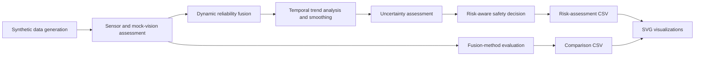
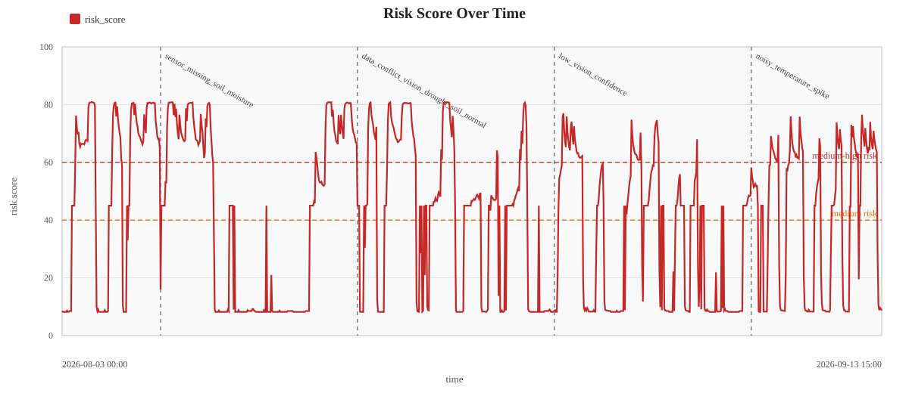
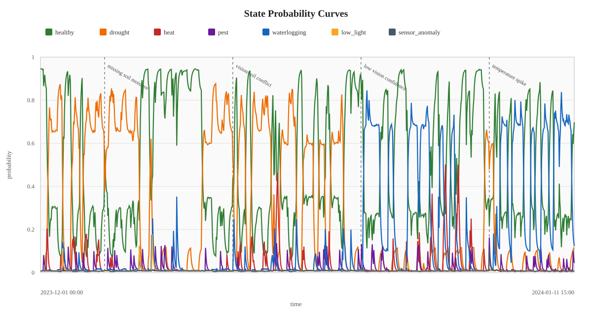
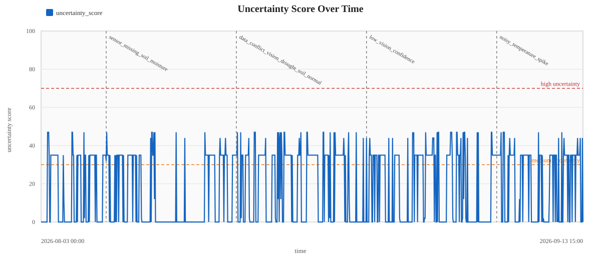
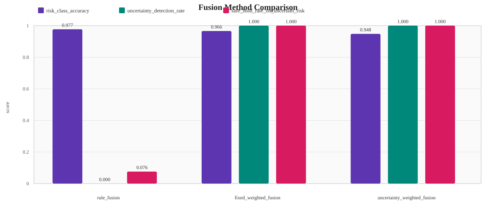

# Uncertainty-Aware Multimodal Crop Monitoring

A simulation-based prototype for crop-risk monitoring under uncertain environmental and visual observations. The project demonstrates how sensor readings and mock vision outputs can be fused into probabilistic crop-state estimates, then converted into risk-aware recommendations that defer action when evidence is unreliable or contradictory.

This repository uses **synthetic environmental data** and **mock vision labels** only. It is not an IoT deployment, does not include field data or real imagery, and has not been validated on agricultural hardware or in field conditions.

## Method

The pipeline models the crop state as a probability distribution over healthy, drought, heat, pest, waterlogging, low-light, and sensor-anomaly conditions.

1. Generate deterministic hourly synthetic data for environmental variables and mock visual observations.
2. Validate values, identify missing or anomalous sensor readings, and estimate sensor- and vision-specific state probabilities.
3. Adjust modality weights for missing values, anomalies, low visual confidence, and cross-modal conflicts.
4. Fuse and temporally smooth the state probabilities with a six-hour trend window and exponential moving average.
5. Calculate uncertainty and return a conservative recommendation such as observing, resampling, or rechecking before an intervention.

The evaluation compares a rule baseline, fixed-weight probabilistic fusion, and uncertainty-weighted fusion. Its labels are derived from the synthetic-data rules, so the reported metrics demonstrate internal behavior rather than real-world predictive performance.

## Architecture



## Quick start

The project uses only the Python standard library. From the repository root:

```bash
python3 scripts/generate_mock_environment_data.py
python3 scripts/analyze_crop_risk.py
python3 scripts/evaluate_fusion_methods.py
python3 scripts/visualize_results.py
```

These deterministic commands regenerate the tracked CSV outputs and SVG figures.

## Outputs

| Path | Description |
| --- | --- |
| `data/mock_environment_data.csv` | 1,000 deterministic hourly synthetic observations |
| `data/risk_assessment_results.csv` | Fused state probabilities, uncertainty, safety policy, and recommendation per observation |
| `data/fusion_method_comparison.csv` | Aggregate comparison of the three fusion methods |
| `data/fusion_method_predictions.csv` | Per-observation predictions for each method |
| `figures/*.svg` | Risk, uncertainty, state-probability, and method-comparison visualizations |

## Evidence and results

The tracked synthetic dataset contains 1,000 hourly observations from `2023-12-01 00:00` to `2024-01-11 15:00`. These are simulation timestamps selected for the synthetic evaluation sequence within the project period, not evidence of real data collection or field deployment in 2023-2024. The evaluation produces 3,000 predictions: each observation is scored by three methods. The table reproduces the values in [`data/fusion_method_comparison.csv`](data/fusion_method_comparison.csv); risk-class and binary-risk accuracy are agreement with simulation-derived reference labels, not field-validation metrics.

| Method | Risk-class accuracy | Binary-risk accuracy | Uncertainty detection | Conflict detection | Anomaly detection | Safe hold on uncertain risk |
| --- | ---: | ---: | ---: | ---: | ---: | ---: |
| Rule fusion | 0.977 | 0.980 | 0.000 | 0.000 | 1.000 | 0.076 |
| Fixed-weight fusion | 0.966 | 0.968 | 1.000 | 1.000 | 1.000 | 1.000 |
| Uncertainty-weighted fusion | 0.935 | 0.947 | 1.000 | 1.000 | 1.000 | 1.000 |



*Risk score over the 1,000 synthetic observations, with medium- and medium-high-risk thresholds and markers for inserted uncertainty cases.*



*Temporally smoothed probabilities for the modeled crop and sensor states, showing how the dominant state changes over the simulated sequence.*



*Uncertainty score over the synthetic sequence, with thresholds and markers for the four deliberately introduced uncertainty scenarios.*



*Comparison of the three implemented fusion methods using the simulation-derived evaluation metrics reported above.*

## Repository layout

```text
.
├── data/       # Synthetic input and reproducible evaluation outputs
├── figures/    # SVG visualizations generated from the outputs
├── scripts/    # Standard-library Python pipeline
└── README.md
```

## Limitations

- The environmental values, visual labels, and evaluation labels are simulated.
- `image_status` and `vision_confidence` stand in for a vision model; no model training or images are included.
- Fusion weights, thresholds, and safety policies are hand-designed rather than calibrated from field data.
- Temporal smoothing is a lightweight heuristic, not a validated Bayesian state estimator.
- Recommendations are software outputs only; the project does not control irrigation, robots, or other physical systems.

## Future extensions

Useful next steps include replacing mock inputs with documented public or field datasets, calibrating uncertainty and thresholds against expert labels, evaluating with learned visual models, and connecting the decision layer to a separately validated operational workflow.
